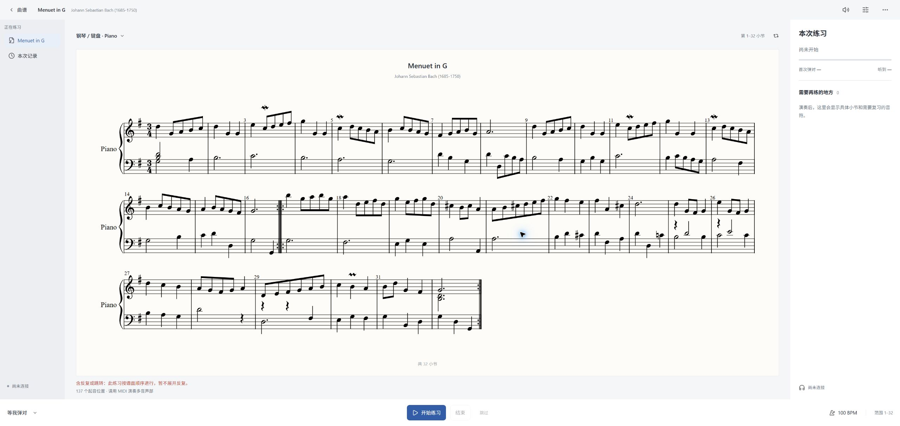

<div align="center">

# NoteLite

**把纸上的乐谱，变成可以校对、试听和练习的乐谱。**

识谱与校谱 · MusicXML / MIDI 导出 · 跟谱陪练

[](https://github.com/Lucas0623z/NoteLite/releases)
[](#从源码运行)
[](apple/README.md)
[](apple/README.md)

[下载](https://github.com/Lucas0623z/NoteLite/releases) · [快速开始](#快速开始) · [Apple 客户端](apple/README.md) · [问题反馈](https://github.com/Lucas0623z/NoteLite/issues)

</div>

---

NoteLite 基于 Audiveris 识谱引擎，保留原版桌面编辑器，并加入独立的陪练模式。你可以识别 PDF 或图片，在谱面上检查、修正结果，再导出 MusicXML / MIDI，或直接进入跟谱练习。

| 原版桌面编辑器 | 新增陪练模式 |
| :---: | :---: |
| [](docs/images/desktop-editor.png) | [](docs/images/practice-workspace.png) |
| 识别、检查和修正谱面 | 跟谱演奏、查看错音与练习回顾 |

两张截图展示同一首《G 大调小步舞曲》。原版编辑器保持可用，陪练从“文集”菜单进入，在本地浏览器中打开。

## 识谱、校谱，再练习

| 识谱与校谱 | 乐器陪练 |
| --- | --- |
| 导入 PDF、扫描件与乐谱图片 | 导入 MusicXML / MXL，或使用当前识别结果 |
| 在原版桌面编辑器中检查和修改识别结果 | 按谱中乐器信息选择输入方式，也可手动调整 |
| 导出 MusicXML、压缩 MusicXML 和 MIDI | 选择声部、小节与速度，跟着谱面练习 |
| 保留中文菜单、工具栏和完整校谱流程 | 提示错音与漏音，结束后查看回顾、重练片段 |

陪练提供等待弹对再继续、按节拍跟奏两种模式。谱面显示与音高检测在本机完成；桌面入口会打开本地浏览器页面，原版编辑器继续保留。

### 输入方式

| 输入 | 适用范围 |
| --- | --- |
| MIDI | 支持 MIDI 输出的乐器，可识别单音与和弦，检查音高和起音时机 |
| 麦克风 | 单声部、有固定音高的旋律；不支持和弦、扫弦或合奏的逐音评分 |
| 电脑键盘 | 体验跟谱与错音提示的演示输入 |

自动判断依据是乐谱中的乐器名称、声部与 MIDI 音色信息；缺少信息时可以手动选择。当前陪练不评价音色、踏板、指法或触键，各类真实乐器的连续演奏效果仍需进一步验收。

已安装 [PianoBooster](https://www.pianobooster.org/) 的用户，也可从桌面菜单将当前谱子或外部 MIDI 交给它练习。其他识谱软件导出的 MusicXML / MXL 可以直接导入 NoteLite；这些入口通过文件互通。

## 平台支持

| 版本 | 主要用途 | 说明 |
| --- | --- | --- |
| Windows / Linux / macOS 桌面版 | 完整识谱、手动校谱、导出与陪练 | Java 桌面编辑器；macOS 提供 Apple Silicon / Intel 打包流程 |
| iPhone / iPad 原生客户端 | 曲谱库、原稿预览、识谱任务、陪练与练习记录 | iOS / iPadOS 16 起；手机导航和平板分栏布局 |
| macOS 原生客户端 | 曲谱库、识谱任务、陪练与练习记录 | macOS 13 起；SwiftUI 分栏工作区 |

Apple 原生客户端通过你配置的[识谱桥接服务](bridge/README.md)处理 PDF 和图片，不在设备上运行 Java 识谱引擎；已有 MusicXML 可以直接进入练习。完整的手动校谱仍在桌面编辑器中完成。

Apple 构建目前用于开发测试，未上架 App Store。真机安装或对外分发需要配置自己的签名。详见 [Apple 客户端说明](apple/README.md)与 [macOS 桌面打包说明](packaging/MACOS.md)。

## 快速开始

### 使用桌面版

1. 在 [Releases](https://github.com/Lucas0623z/NoteLite/releases) 下载适合系统的安装包或分发包，以该版本的发布说明为准。
2. ZIP 分发包解压后，运行 `bin/NoteLite.bat`（Windows）或 `bin/NoteLite`（Linux / macOS）。这类包需要本机安装 **Java 21**；包含 Java 运行时的 macOS 安装包无需另装 Java。
3. 打开 PDF 或乐谱图片，完成识别，并在编辑器中校对结果。
4. 导出 MusicXML / MIDI，或选择 **文集 → 乐器陪练工作室**。

已有其他软件导出的乐谱，可选择 **文集 → 导入外部识谱结果练习**。当前源码的分发包还提供 `bin/PracticeStudio.bat` / `bin/PracticeStudio`，用于直接打开陪练；不指定文件时打开示例谱。

> 陪练以导入的乐谱为判断依据。开始前请先核对识谱结果，避免把识别错误当作演奏错误。旧版本发行包可能不包含当前源码中的新增功能。

### 从源码运行

安装 **JDK 21**，并让 `JAVA_HOME` 指向该版本：

```sh
git clone https://github.com/Lucas0623z/NoteLite.git
cd NoteLite

# 启动原版桌面编辑器
./gradlew :app:run --no-daemon

# 生成包含编辑器与陪练入口的分发包
./gradlew :app:distZip --no-daemon
```

Windows 使用 `./gradlew.bat`。分发 ZIP 位于 `app/build/distributions/`；首次识谱如需 OCR 语言数据，可在应用的语言设置中配置。

陪练运行资源已随源码保存。修改陪练界面时，使用 **Node.js 20+** 重新生成资源：

```sh
cd practice-web
npm ci
npm test
npm run build
```

Apple 原生客户端需在 Mac 上使用 Xcode 与 XcodeGen 构建，完整步骤见 [apple/README.md](apple/README.md)。

## 实测与文档

识谱、MIDI 导出和陪练输入是不同环节，分别验证；小样本测试结果不代表所有乐谱或所有乐器的准确率。

| 文档 | 内容 |
| --- | --- |
| [图片 / PDF 转 MIDI 实测](benchmarks/omr/README.md) | 原始输入、独立参考答案、真实识谱输出和复现方式 |
| [MIDI 导出验证](benchmarks/midi/README.md) | MusicXML 写入 MIDI 的音高、时序与导出回归 |
| [陪练说明与录音乐器样本测试](practice-web/README.md) | 输入范围、已知限制、样本来源与测试命令 |
| [Apple 客户端](apple/README.md) | 三端构建、签名设置、界面测试与真机验收 |
| [识谱桥接服务](bridge/README.md) | 在自己的电脑或服务器提供识谱接口 |
| [macOS 桌面打包](packaging/MACOS.md) | Apple Silicon / Intel 安装包、签名与公证 |

## 开源来源与许可

- [Audiveris](https://github.com/Audiveris/audiveris)：桌面识谱与校谱引擎；衍生源码保留 AGPL-3.0-or-later 许可声明。
- [OpenSheetMusicDisplay](https://github.com/opensheetmusicdisplay/opensheetmusicdisplay)：陪练谱面排版。
- [Pitchy](https://github.com/ianprime0509/pitchy)：单声音高检测。
- [Lucide](https://lucide.dev/)：陪练界面图标。

本仓库包含不同许可的代码和资源。根目录保留 [MIT 声明](LICENSE)；各源文件的许可头、上游许可及[陪练第三方声明](app/res/practice/THIRD-PARTY.txt)适用于对应部分，不能将整个 Audiveris 衍生程序视为仅受 MIT 许可约束。

---

由 [Yuexuan Zhang · @Lucas0623z](https://github.com/Lucas0623z) 维护。问题和建议可提交 [Issue](https://github.com/Lucas0623z/NoteLite/issues)，或联系 [Lucas.z0623@outlook.com](mailto:Lucas.z0623@outlook.com)。
